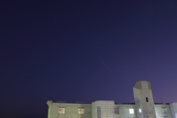
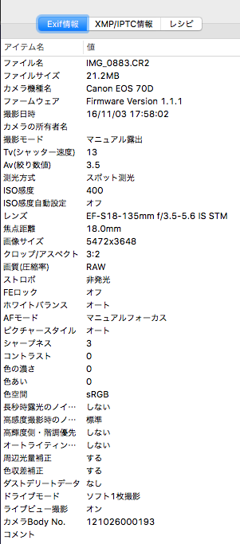
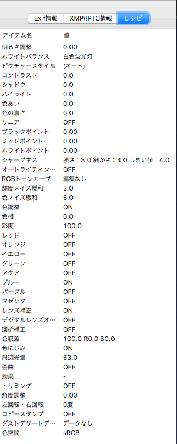

# いろいろな画像形式をgithubに上げる

一眼レフなどの撮影した画像について、TwitterやLINEなどSNSツールなどに投稿すると画質(解像度や階調数)が低下したり、Exif情報が削除されてしまったりします。

そこで、容量無制限!?のgithubに画像を投稿したらいいんじゃないかと思ってやってみました。

---
## とりあえず、いろんな画像形式


[JPG]()


TIF


CR2

(やはりTIFやCR2はそのままでは表示できないみたい。)

  
PNG0  
  
PNG1

```
TIFからpngにImageMagicのコマンドを利用した際に2枚の画像が出力されました。
(PNG1に出力されるのは、サムネイル用の小さな画像?)
```

###### memo
- 撮影はCR2(CanonのRAW規格)で行う。
- CR2 -> JPG : Digital Photo Professional 4
- CR2 -> TIF(16bit) : Digital Photo Professional 4
  - TIF(16bit) -> TIF(13bit) : ImageMagick 6.9.2-10
- TIF(14bit) -> PNG(14bit) : ImageMagick 6.9.2-10

途中でゴニョゴニョbit数が変わっているのかは後述します。


---
#### 画像情報
CR2(RAW)をCanonのカメラ付属ソフトDigital Photo Professional 4を用いて表示した画像の情報です。

| Exif情報 | 編集情報 |
|:--|:--|
|||


### 各画像の情報

ImageMagickのコマンドidentifyを利用して各画像の情報をしらべた結果です。  
(identify <画像ファイル名>)
```
# JPG
IMG_0883.JPG JPEG 5472x3648 5472x3648+0+0 8-bit sRGB 9.1MB 0.000u 0:00.000
# PNG1
IMG_0883-0.PNG PNG 5472x3648 5472x3648+0+0 16-bit sRGB 51.45MB 0.000u 0:00.000
# PNG2
IMG_0883-1.PNG PNG 252x168 252x168+0+0 8-bit sRGB 35.8KB 0.000u 0:00.000
# TIF
IMG_0883.TIF[0] TIFF 5472x3648 5472x3648+0+0 16-bit sRGB 119.9MB 0.000u 0:00.000
IMG_0883.TIF[1] TIFF 252x168 252x168+0+0 8-bit sRGB 119.9MB 0.000u 0:00.000
```
- CR2はCanonの独自規格であるため、結果が得られませんでした。
- TIFファイルには2種類の画像が含まれており、2種類の解像度が出力されました。)


**ざっくりまとめると以下のような感じです**

 | 形式 | JPG | PNG0 | PNG1 | CR2 |  TIF  |
 | ---: | :---: | :---: | :---: | :---: | :--: |
 | 容量 | 9.1MB | 51.4MB | 36K | 22.2MB | 119.9M |
 | Exif |  ◯(設定)  |  ×  |  ×  |  ◯  |  ◯  |
 | 階調数 | 8bit | 16bit | 8bit |  14bit  | 16bit |


TIFファイルについては、単体で100MBを超えるファイル容量です。これは、githubにアップロードする際に
```
remote: error: File IMG_0883.TIF is 114.36 MB; this exceeds GitHub's file size limit of 100.00 MB
```
と言われ、アップロードできませんでした＞＜ 残念。

そもそも、カメラ(EOS70D)の仕様で階調数は**14bit**なので、16bitのうち2bitは利用していないことになります。

そこで、TIFを14bit(3*2^14 = 49152)に変換してから、アップロードしてみます。
同様にPNGも14bitで生成したTIFファイルから作成し直します。

```
convert <input_file> -depth 14 <output_file>
```

ですが…残念ながら14bitにしてもファイルサイズが105M。ここからExifを消しても対して変わらず…
アップロードできなければもともこも無いので、結局13bitにしました。(ゆーて、一般のディスプレイでは最大で10bitの分解能しか表示できないらしいので普通の見た目にはわからないですね〜)

pngは14bitに変換したtifから生成し直しました。

その結果、新たに得られた各画像の情報は以下のようになりました。

| 形式 | JPG | PNG0 | PNG1 | CR2 | TIF |
| ---: | :--- | :--- | :--- | :--- | :--- |
| 容量|9.1MB|49.5MB|54K|22.2MB|97.6M |
| Exif| ◯(設定?) | × | × | ◯ | ◯ |
| 階調数 | 8bit | 14bit | 8bit | 14bit | 13bit |

PNG1の容量が増えた気がしますが、あまり気にしないことにします。もともと小さいファイルなので…

| hoge | moge |
| :--- | :--- |
| aaaa | iiii |
