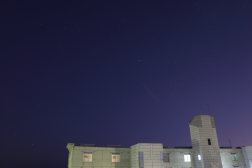

# いろいろな画像形式をgithubに上げる

一眼レフで撮影した画像について、TwitterやLINEなどSNSツールなどに投稿すると画質が低下したり、Exif情報が削除されてしまったりします。

そこで、githubに画像を投稿したらどうなるのか、調べてみました。

---
## とりあえず、いろんな画像形式


JPG


TIF


CR2

(やはりTIFやCR2はそのままでは表示できないみたい。)

  
PNG0  
  
PNG1

```
TIFからpngにImageMagicのコマンドを利用した際に2枚の画像が出力されました。
(PNG1に出力されるのは、サムネイル用の小さな画像?)
```

###### memo
- 撮影はCR2(CanonのRAW規格)で行う。
- CR2 -> JPG : Digital Photo Professional 4
- CR2 -> TIF : Digital Photo Professional 4
- TIF -> PNG : ImageMagick 6.9.2-10

---
#### 画像情報
CR2(RAW)からCanonのカメラ付属ソフトDigital Photo Professional 4を用いて表示した画像の情報です。

| Exif情報 | 編集情報 |
|:--|:--|
|||


### 各画像の情報

すべての画像は 5472×3648 です。

|  |JPG|PNG0|CR2|TIF|
|--:|:-:|:-:|:-:|:-:|
|容量|9.1MB|51.4MB|22.2MB|119.9M|
|Exif|◯(設定による?)|×|◯|◯|

